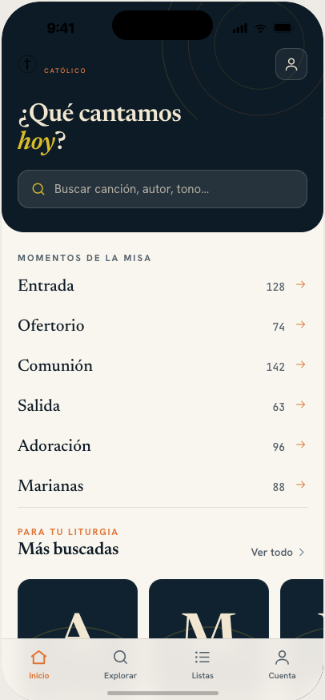
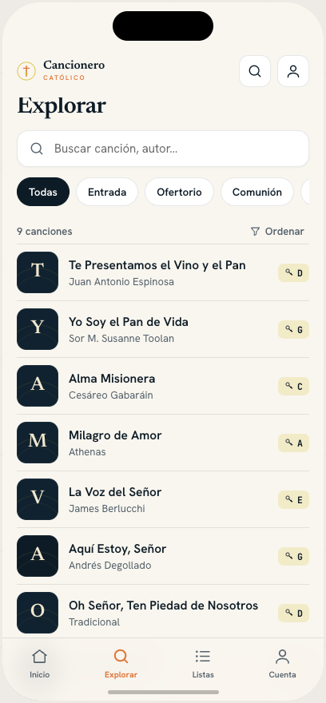
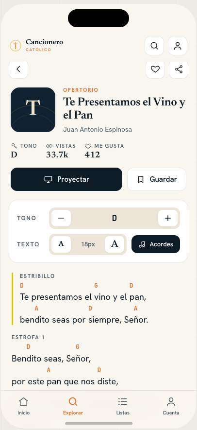

# Cancionero Católico — Frontend

A modern rebuild of [cancionero-catolico.org](https://cancionero-catolico.org) — a Catholic songbook used by worship teams across Latin America to find songs, view lyrics with chords, and manage repertoire.

<div align="center">
  
  &nbsp;&nbsp;
  
  &nbsp;&nbsp;
  
</div>

---

## Features

- **Account management** — magic-link / OTP authentication (no passwords)
- **Songs with lyrics and chords** — structured block layout with section labels (Estrofa, Estribillo, Puente)
- **Chord transposition** — raise or lower the key in real time; supports Spanish notation (SOL, DO, RE…)
- **Fit-to-screen scaling** — chord view auto-scales on narrow screens to eliminate horizontal overflow
- **Song presentation** — full-screen slide mode via Reveal.js for projecting during liturgy
- **Favorites** — save songs to a personal list
- **Song lists** — curate and manage custom repertoire sets

---

## Stack

| Layer | Technology |
|---|---|
| Framework | Next.js 16.2 (App Router) |
| UI | React 19, Tailwind CSS v4, HeroUI v3 |
| State | Zustand (auth), SWR (server data) |
| HTTP | Axios (singleton client with JWT interceptor) |
| Presentations | Reveal.js via `@revealjs/react` |
| Forms | React Hook Form + Zod |
| Testing | Vitest 4, Testing Library, Playwright |
| Language | TypeScript (strict) |

---

## Backend Communication

The frontend talks to a Django REST API. All calls go through a singleton Axios instance (`src/lib/api/client.ts`) configured with `NEXT_PUBLIC_API_URL`.

**Auth flow (magic-link / OTP):**
1. User requests a magic link → backend sends an email with an OTP.
2. `verifyOtp` exchanges the OTP for `{ access_token, refresh_token }`.
3. `access_token` is stored in a module-level variable (avoids synchronous localStorage reads on every request) and persisted to `localStorage` for page reloads.
4. Every request includes `Authorization: Bearer <token>` via an Axios request interceptor.
5. On 401, the interceptor auto-refreshes via the Next.js BFF route `/api/auth/refresh`, retries the original request, and clears both tokens if refresh also fails.

Server Components and Route Handlers use `API_URL_INTERNAL` to bypass the public gateway.

---

## Code Structure

```
src/
├── app/                    # Next.js App Router
│   ├── (auth)/             # login, registro, verificar
│   ├── (public)/           # canciones, explorar
│   └── (dashboard)/        # favoritos, mis-listas (auth-gated)
├── components/
│   ├── atoms/              # Chord, KeyBadge, CoverArt, Logo
│   ├── molecules/          # SongCard, SongRow, SearchBar, MagicLinkForm
│   ├── organisms/          # SongLyricsRenderer, ChordControls, SongPresentation, Navbar
│   └── templates/          # PublicLayout, DashboardLayout, PresentationLayout
├── hooks/                  # SWR data hooks, useFitScale
├── lib/
│   ├── api/                # Axios client, endpoint functions
│   ├── lyrics/             # Parser, transpose (English + Spanish notation)
│   └── utils/              # cn(), song-param encoding
├── store/                  # Zustand auth store
└── types/                  # Shared TypeScript interfaces
```

**Key practices:**

- **Atomic design** — strict tier separation; organisms never import other organisms.
- **Types in `src/types/`** — all prop interfaces live in domain files (`song.ts`, `user.ts`), never inline.
- **Co-located child components** — organisms > ~80 lines split into named child files within the same folder, not promoted to a new tier.
- **HeroUI-first** — custom primitives only when HeroUI has no equivalent.
- **No inline styles** — Tailwind classes exclusively; `cn()` for conditional composition.
- **Spec-driven development** — features start as Gherkin specs in `.specs/`; tests are generated before implementation.
- **Test coverage** — Vitest + Testing Library for units and components; Playwright for E2E.

---

## Getting Started

```bash
bun install
bun dev          # http://localhost:3000

bun test         # unit + component tests (Vitest)
bun test:e2e     # E2E tests (Playwright)
bun type-check   # tsc --noEmit
bun lint         # ESLint
```

**Required environment variables:**

```env
NEXT_PUBLIC_API_URL=        # Public API base URL (client-side Axios)
NEXT_PUBLIC_APP_URL=        # Canonical app origin
NEXT_PUBLIC_API_HOST=       # Allowed hostname for next/image
API_URL_INTERNAL=           # Server-side API URL (Route Handlers, Server Components)
```
